# 今日学习目标

<font face="黑体" color=Violet size = 6>使用Postman管理、执行测试用例生成测试报告</font>

# Postman 高级用法

## ==管理测试用例Collections==

创建 collections 

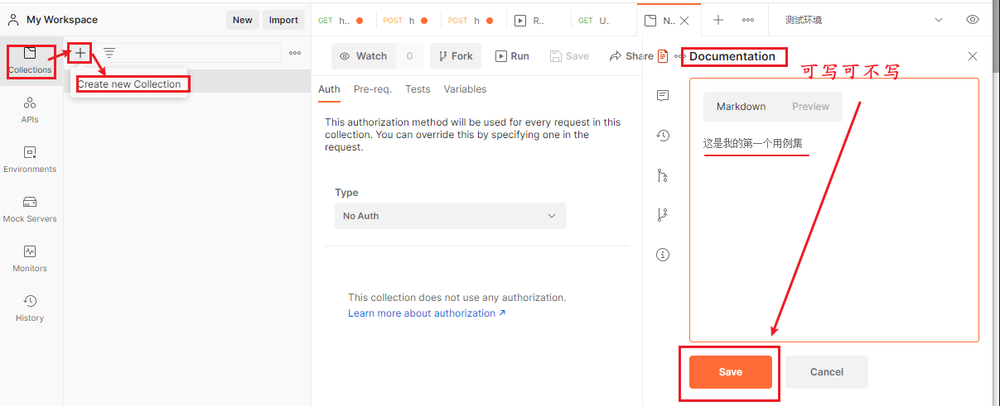


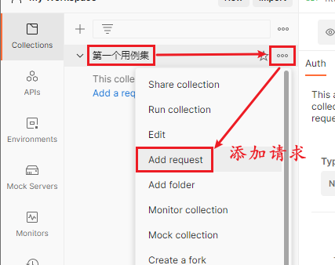

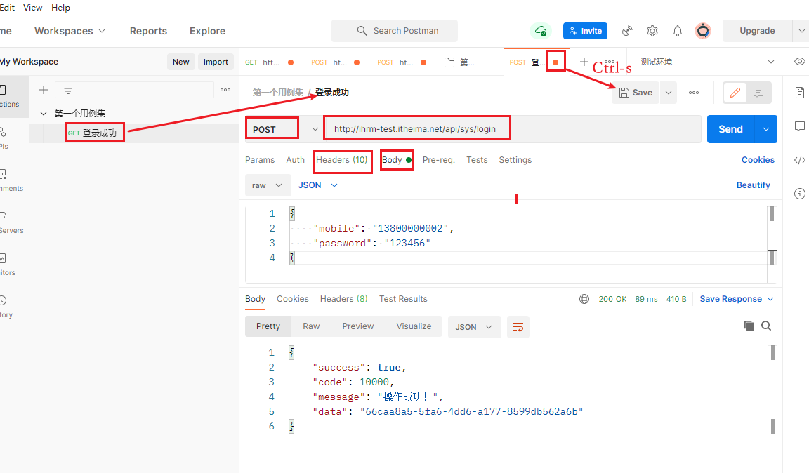

创建 用例集、子目录和 请求


## 用例集导出、导入

**导出**


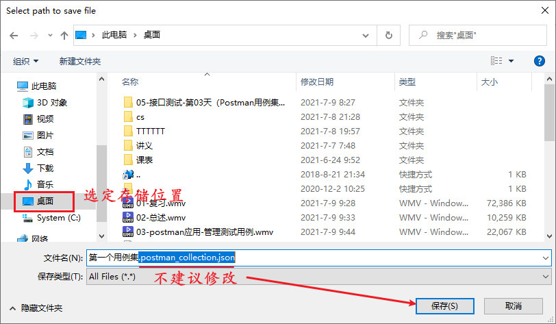

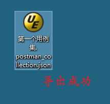

**导入**


## ==Postman 断言==

### Postman 断言简介

- postman 断言借助 JavaScript - js 语言编写代码，自动判断预期结果与实际结果是否一致。
- 断言 代码写在 Tests 的标签中。

### Postman 常用断言

#### ==1. 断言响应状态码==

**Status code: Code is 200**

1. 在 Tests 标签中，选中 Status Code：code is 200， 生成对应代码
2. 适当调整 test() 方法参数1，和 匿名函数中的 预期结果。
3. 点击 send 按钮，发送请求，执行断言代码。
4. 查看断言结果。

```js
// 断言响应状态码 是否为 200
pm.test("Status code is 200", function () {
    pm.response.to.have.status(200);
});

pm：代表 postman 的一个实例
test()：是 pm实例的一个方法。有两个参数
	参数1：在断言成功后，给出的文字提示。可以修改。"Status code is 200"
	参数2：匿名函数。
pm.response.to.have.status(200); 
// 意思：postman 的响应结果中应该包含状态码 200
		200 ——> 预期结果！
```

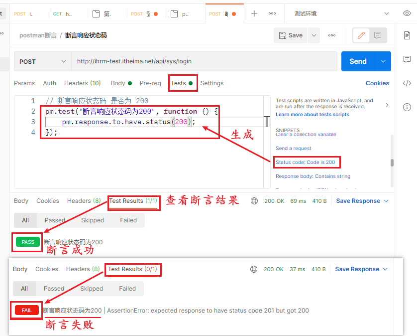

#### 2. 断言响应体是否包含某个字符串

**Response body: Contains string**

```js
// 断言响应体包含指定字符串
pm.test("Body matches string", function () {
    pm.expect(pm.response.text()).to.include("string_you_want_to_search");
});

pm：postman的一个实例
test(): postman实例的方法，有两个参数
	参1：断言后显示的文字提示信息，可改。
    参2：匿名函数
pm.expect(pm.response.text()).to.include("string_you_want_to_search"); 
// 意思：pm 期望 响应文本 中，包含 xxxx 字符串。
	"string_you_want_to_search" ——> 预期结果。 可以修改
```


#### 3. 断言响应体是否等于某个字符串（对象）

**Response body: Is equal to a string**

```js
// 断言 响应体 等于某个字符串（对象）
pm.test("Body is correct", function () {
    pm.response.to.have.body("response_body_string");
});

pm.response.to.have.body("response_body_string");

// 意思是，pm 的 响应中应该有 响应体 xxx
"response_body_string" ——> 预期结果。 可以修改
```


#### ==4. 断言JSON数据==

**Response body: JSON value check**

```js
// 断言json的响应结果
pm.test("Your test name", function () {
    var jsonData = pm.response.json();
    pm.expect(jsonData.value).to.eql(100);
});
var jsonData = pm.response.json();
// var jsonData： 用js语法定义一个变量。jsonData 就是变量名
// pm.response.json();  代表响应的json结果

/* 举例：response.json();
{
    "success": true,
    "code": 10000,
    "message": "操作成功！",
    "data": "95c78d75-721c-40fb-b2d5-742fea42cbd5"
}
*/
pm.expect(jsonData.value).to.eql(100);
// 意思：pm 预期 json结果 key对应的值 等于 xxx
// to.eql(100); 中的 100 代表预期结果。可以修改的。

/* 举例：
		jsonData.value 的  value：
        取 ：success、code、message、data
*/
```

示例：

```js
// 断言json的响应结果-success的值为true
pm.test("断言响应结果success的值为true", function () {
    var jsonData = pm.response.json();
    pm.expect(jsonData.success).to.eql(true);
});

pm.test("断言响应结果中code的值为10000", function () {
    var jsonData = pm.response.json();
    pm.expect(jsonData.code).to.eql(10000);
});

pm.test("断言响应结果中message的值为 操作成功", function () {
    var jsonData = pm.response.json();
    pm.expect(jsonData.message).to.eql("操作成功！");
});
```

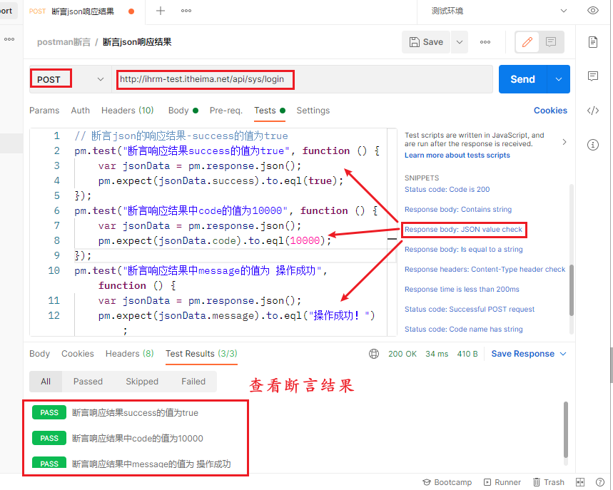

#### 5. 断言响应头

**Response headers: Content-Type header check**

```js
// 断言响应头
pm.test("Content-Type is present", function () {
    pm.response.to.have.header("Content-Type");
});

pm.response.to.have.header("Content-Type");
// pm 的响应 头中包含 Content-Type

// 示例：可以在 header 中，添加 响应头中的 key 对应的 value 判定。用 ，隔分。
// 断言响应头
pm.test("Content-Type is present", function () {
    pm.response.to.have.header("Content-Type", "application/json;charset=UTF-8");
});
```

### Postman断言工作原理

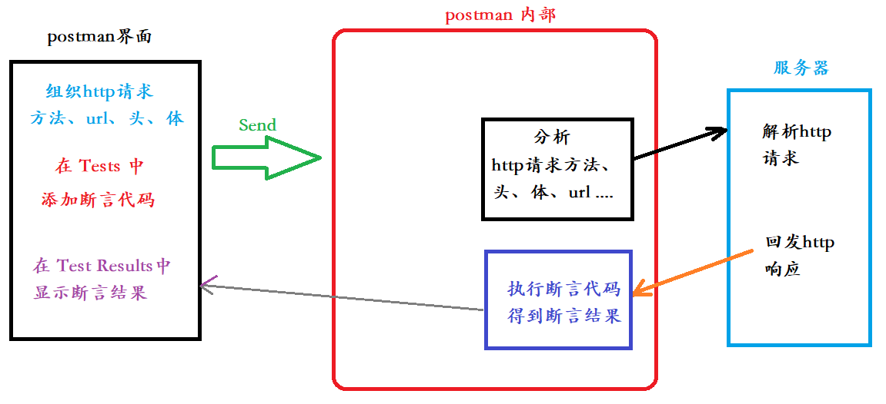


## ==全局变量和环境变量==

**全局变量**

- 概念：在 Postman 全局生效的变量，全局唯一。

- 设置：

    - **代码设置**：`pm.globals.set(“全局变量名”，全局变量的值)`

        ```js
        // 示例：
        pm.globals.set("glb_age", 100)
        ```

- 获取：

    - **代码获取**: `var 接收值的变量 = pm.globals.get(“全局变量名”)`

        ```js
        // 示例：
        var ret = pm.globals.get("glb_age")  // ret 的值为 100
        ```

    - **请求参数获取**（postman界面获取）: `{{全局变量名}}`

        ```js
        // 示例：
        {{glb_age}}
        ```

**环境变量**

- 概念：在 特定环境（生产环境、开发环境、测试环境）下，生效的变量，在本环境内唯一。

- 设置：

    - 代码设置：`pm.environment.set("环境变量名", 环境变量值)`

        ```js
        // 示例
        pm.environment.set("env_age", 99)
        ```

- 获取：

    - 代码获取：`var 接收值的变量 = pm.environment.get("环境变量名")`

        ```js
        // 示例
        var ret = pm.environment.get("env_age")  // ret 的值为 99
        ```

    - 请求参数获取（postman界面获取）：`{{环境变量名}}`

        ```js
        // 示例
        {{env_age}}
        ```


## Postman 请求前置脚本

- 在 send 按钮点击后，请求前置脚本代码，第一时间被执行。在 postman 内部实际 http请求之前。

> 假设，这样一种场景：
>
> ​		调某接口时，要输入 “时间戳”，如果输入的 “时间戳” 的绝对值，超过标准时间10分钟。 则不允许调用。

### 时间戳

- 时间戳：对应绝对时间，从 1970年1月1日00:00:00 到现在 所经历的秒数。


> 一天：86400秒
>
> 51年 6月（180） 9天  --- 1,624,665,600 秒

### 案例

>  调用百度首页接口，传时间戳给服务器		

实现步骤：

1. 在 Pre-request Script 标签页中，添加代码。拿到时间戳，写入全局变量

    ```js
    // 拿到时间戳
    var timestamp = new Date().getTime()
    
    // 将时间戳设置到 全局变量
    pm.globals.set("glb_timestamp", timestamp)
    ```

2. 点击 Send 按钮，发送请求。请求发送前执行 上述代码。写入全局变量

3. 查看写入的变量

    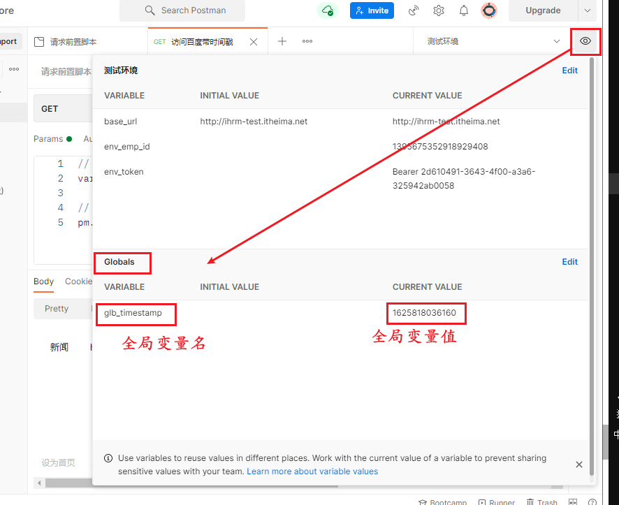

4. 在 请求参数(界面)中，使用全局变量。{{全局变量名}}

    

5. 在 postman的 控制台，查看 发送的 http请求

    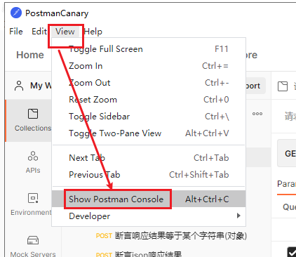

    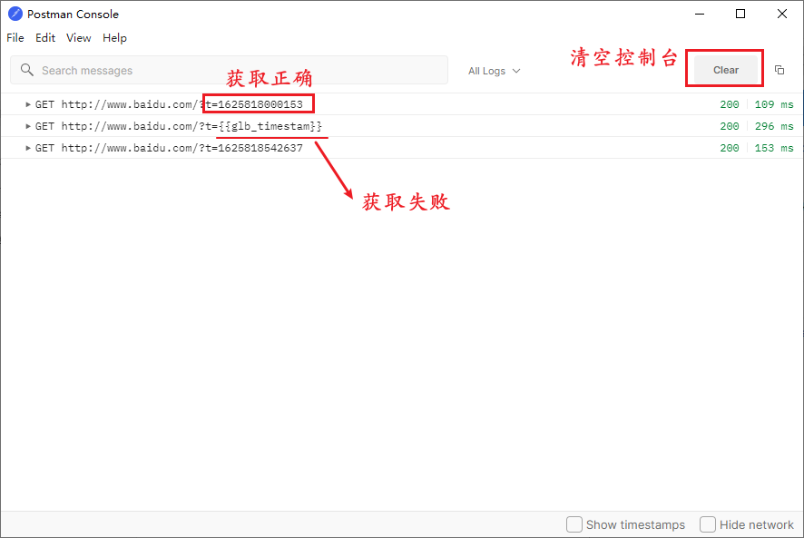

### 工作原理


## ==Postman 关联==

**介绍：**应用于 多个 http请求之间，有数据关联、或依赖关系时。

### 实现步骤

A接口 依赖 B接口 的数据

1.  向B接口发送http请求，获取数据
2.  将数据 设置 至 全局变量（环境变量）中
3.  A 接口 获取 全局变量（环境变量）中 数据值，进行使用。

### 案例

> 请求  获取天气接口， 提取响应结果中的 城市， 将城市名，给百度搜索接口使用。

实现步骤：

1.  创建 用例集，分别创建 查询天气 请求 和 百度搜索的请求

    

2. 在查询天气请求 Tests 中，编写代码 获取 城市名，写入全局变量

    ```js
    // 获取 全部响应结果
    var jsonData = pm.response.json()
    // 从响应结果中 获取 城市名
    var city = jsonData.weatherinfo.city
    // 将城市名写入到全局变量
    pm.globals.set("glb_city", city)
    ```

3.  点击 Send 按钮，发送 请求，查看设置的全局变量。

    

4.  修改 百度搜索请求，使用全局变量，按 城市名进行搜索。

    ```url
    http://www.baidu.com/s?wd={{glb_city}}
    ```

    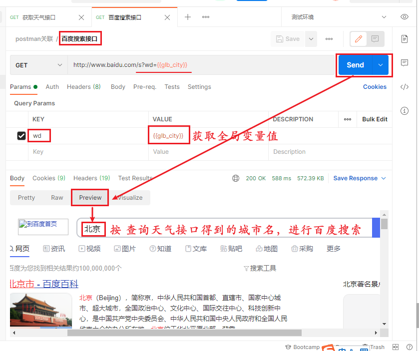

## 批量执行测试用例


# ==Postman 测试报告==

## 安装newman

- 参见 课前下发的 ”Postman相关安装“ 目录下的《Postman环境安装.pdf》文件中 “安装Postman插件newman” 小节。


## ==使用newman生成测试报告==

步骤：

1.  批量执行测试用例集。（确认无误）

2.  导出 Export 用例集。（得到 xxxx.json文件）

3.  在 终端 中 执行命令，生成测试报告

    ```shell
    # 现在 终端中，测试一下。
    newman run xxxx.json
    
    # 完整的命令
    newman run xxxx.json -e 环境变量文件 -d 外部数据文件 -r html --reporter-html-export 测试报告名.html
    
    # 示例：
    newman run 批量执行测试用例.postman_collection.json -r html --reporter-html-export 我的第一个测试报告.html
    
    # 如果添加 -r html 就报错！说明: newman-reporter-html 安装失败！
    ```

    

# 作业

1. **完成每日反馈**
2. 完成作业《接口测试-第03天-作业.md》
3. 预习 引入外部文件 和 项目实战

